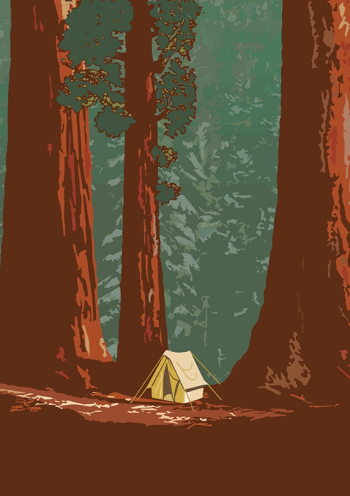

Programmer, nerd, person that likes foxes quite a bit.

### 🌱 What I'm Up To

Here are some recent adventures:

- [**firefox-minima**](https://github.com/rockofox/firefox-minima): Minimalist Firefox Theme inspired by qutebrowser
- [**indigo**](https://github.com/rockofox/indigo): Multiparadigm programming language designed to be satisfyingly functional
- [**intellij-haskell-lsp**](https://github.com/rockofox/intellij-haskell-lsp): Haskell language support in IntelliJ via `haskell-language-server`
- [**tatoeba-lookup**](https://github.com/rockofox/tatoeba-lookup): A WebExtension that allows users to fetch and display definitions for selected words from the Tatoeba dictionary.
- [**aurora**](https://github.com/rockofox/aurora): A x86 kernel written in C mostly as a learning experience
- [**rivalbattery**](https://github.com/rockofox/rivalbattery): macOS application to show SteelSeries mouse battery level in the menu bar
- [**system**](https://github.com/rockofox/system): System configuration using nix.

Thanks for stopping by!
